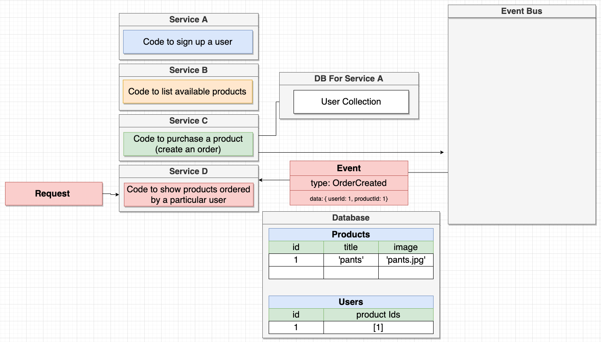

# Microservices with Node and React

## **Fundamentals**

In comparison to a monolith, a MS contains all aspects to make a single feature work instead of all features

**Pros**:

- Standalone: easier to debug and isolate
- Easily swappable
- Errors can be isolated to few MS instead of the whole app
- (Database-Per-Service) Each MS only uses its own Database in which case points of failure can be isolated
- Some MS may use different DBs (or other components) to optimize its feature

**Cons**:

- Data Management between MS since each one is isolated
- MS can never access the DBs of other MS and has to use a workaround that MSs have to provide

## Communication Types

**Synchronous**:

An MS feature directly gets desired data from other MSs to fulfill request.

**Pros**:

- Intuitive, easy to implement
- No own DB needed

**Cons**:

- High dependency with other MSs again
- Request is only as fast as the slowest request to a dependency

**Asynchronous**:

The current standard form of inter MS communication.

In this case, Service D has its own Database, which gets populated through the Event Bus. Services A, B, and C each store data in their respective DBs while also emitting an event to the Event Bus, notifying other services subscribed to the Event Bus about the transaction they made.

**Pros**:

- Independent
- Very fast since it uses own DB
  **Cons**:
- Data duplication since DB is made of data from other DBs

# References
